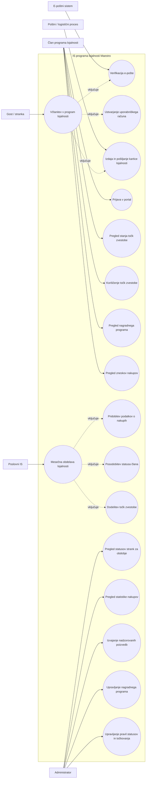
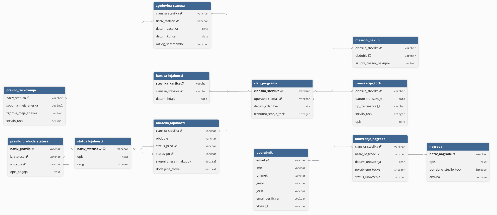

# Specifikacija zahtev za razvoj rešitve za podporo programu lojalnosti Maestro

## 1. Opis sistema

### 1.1 Problemska domena

**Program lojalnosti v trgovski verigi Maestro**

Sistem je namenjen podpori programu lojalnosti trgovske verige Maestro. Glavni cilj rešitve je povečati zvestobo strank, spodbuditi pogostejše in večje nakupe ter omogočiti učinkovito upravljanje programa lojalnosti na ravni podjetja.

Program lojalnosti temelji na vključevanju strank v članski program, dodeljevanju statusov lojalnosti, mesečnem izračunu točk zvestobe ter koriščenju nagrad. Stranke bodo lahko dostopale do spletnega portala, prek katerega bodo spremljale svoje točke, zgodovino nakupov, svoj status in razpoložljive nagrade. Poleg uporabniškega dela mora rešitev vključevati tudi administrativni del za zaposlene v podjetju, kjer bo mogoče upravljati pravila točkovanja, pravila prehodov med statusi, nagradni program in poslovna poročila.

Rešitev bo povezana z obstoječim poslovnim informacijskim sistemom trgovske verige, iz katerega bo mesečno pridobivala podatke o opravljenih nakupih posameznih strank. Sistem mora prav tako omogočati pošiljanje potrditvenih e-sporočil ob registraciji in podporo pošiljanju kartic lojalnosti po navadni pošti.

Sistem bodo uporabljale naslednje skupine uporabnikov:

* **Stranke**: za registracijo, prijavo, pregled točk, koriščenje točk in pregled nagrad.
* **Administratorji**: za pregled statistik, upravljanje pravil programa, upravljanje nagrad in pregled statusov strank.

Sistem mora izpolnjevati tudi pomembne nefunkcionalne zahteve. Zagotavljati mora visoko zmogljivost, saj se pričakuje vsaj 500.000 vključenih uporabnikov, obenem pa mora biti pripravljen na širitev na tuje trge. Podpirati mora slovenski in angleški jezik, uporabljati Oracle podatkovno bazo ter zagotavljati sodoben, intuitiven in varen uporabniški vmesnik.

### 1.2 Namen sistema

Namen sistema je:

* povečati zvestobo strank,
* spodbuditi večjo vrednost nakupov,
* omogočiti digitalno upravljanje programa lojalnosti,
* zagotoviti preglednost nad točkami, statusi in nagradami,
* omogočiti administratorjem učinkovito upravljanje programa.

### 1.3 Uporabniki sistema

* gost (neregistrirana stranka)
* član programa lojalnosti
* administrator

### 1.4 Povezave z drugimi sistemi

Sistem se povezuje z naslednjimi zunanjimi sistemi:

* **Poslovni IS**: vir podatkov o mesečnih nakupih strank
* **E-poštni sistem**: verifikacija registracije in obvestila
* **Oracle podatkovna baza**: hramba vseh podatkov sistema
* **Poštni oziroma logistični proces**: pošiljanje kartic lojalnosti

---

## 2. Funkcionalne zahteve

### 2.1 Seznam funkcionalnih zahtev

| ID    | Funkcionalna zahteva                  | Opis                                                                              | Prioriteta  |
| ----- | ------------------------------------- | --------------------------------------------------------------------------------- | ----------- |
| FZ-01 | Registracija uporabnika               | Sistem mora omogočati spletno registracijo uporabnika v program lojalnosti.       | Must have   |
| FZ-02 | Verifikacija e-pošte                  | Sistem mora preveriti lastništvo e-poštnega naslova prek potrditvenega sporočila. | Must have   |
| FZ-03 | Ustvarjanje uporabniškega računa      | Ob uspešni registraciji sistem ustvari uporabniški račun za dostop do portala.    | Must have   |
| FZ-04 | Generiranje kartice lojalnosti        | Sistem mora za vsakega člana ustvariti kartico lojalnosti.                        | Must have   |
| FZ-05 | Mesečni uvoz nakupov                  | Sistem mora enkrat mesečno pridobiti podatke o nakupih iz poslovnega IS.          | Must have   |
| FZ-06 | Posodabljanje statusa                 | Sistem mora pred izračunom točk preveriti in posodobiti status člana.             | Must have   |
| FZ-07 | Izračun točk zvestobe                 | Sistem mora mesečno izračunati točke glede na znesek nakupov in status stranke.   | Must have   |
| FZ-08 | Pregled točk                          | Uporabnik mora imeti možnost pregleda trenutnega stanja točk.                     | Must have   |
| FZ-09 | Koriščenje točk                       | Uporabnik mora imeti možnost unovčitve točk za nagrade.                           | Must have   |
| FZ-10 | Pregled nagradnega programa           | Uporabnik mora imeti možnost pregleda razpoložljivih nagrad.                      | Must have   |
| FZ-11 | Pregled zgodovine nakupov             | Uporabnik mora imeti možnost pregleda mesečnih zneskov nakupov.                   | Must have   |
| FZ-12 | Upravljanje nagrad                    | Administrator mora upravljati seznam nagrad in pogoje za koriščenje.              | Must have   |
| FZ-13 | Upravljanje pravil točkovanja         | Administrator mora spreminjati pragove in vrednosti pravil za status in točke.    | Must have   |
| FZ-14 | Pregled statusov za obdobje           | Administrator mora pregledovati statuse strank za izbrano obdobje.                | Must have   |
| FZ-15 | Pregled statistike nakupov            | Administrator mora imeti dostop do statističnih pregledov nakupov.                | Must have   |
| FZ-16 | Poljubne poizvedbe po podatkovni bazi | Administrator mora imeti možnost izvajanja nadzorovanih poizvedb nad podatki.     | Must have   |

### 2.2 Pravila izračuna točk

Sistem mora omogočati konfiguracijo pravil za izračun točk, začetna pravila pa so naslednja:

#### a) Če je znesek nakupov do 200 EUR

* osnovni status: 5 točk
* bronasti status: 0 točk
* srebrni status: 7,5 točk
* zlati status: 10 točk

#### b) Če je znesek nakupov med 200 EUR in 1000 EUR

* osnovni status: 10 točk
* bronasti status: 5 točk
* srebrni status: 15 točk
* zlati status: 20 točk

#### c) Če je znesek nakupov nad 1000 EUR

* osnovni status: 20 točk
* bronasti status: 10 točk
* srebrni status: 30 točk
* zlati status: 40 točk

### 2.3 Pravila prehajanja med statusi

Sistem mora podpirati naslednja začetna pravila prehajanja med statusi:

* ob včlanitvi ima stranka status **osnovni**,
* ko z nakupi preteklega meseca prvič preseže 499 EUR, pridobi status **srebrni**,
* če še dvakrat preseže znesek 499 EUR, pridobi status **zlati**,
* za ohranitev statusa **srebrni** mora mesečno doseči vsaj 200 EUR nakupov,
* za ohranitev statusa **zlati** mora mesečno doseči vsaj 500 EUR nakupov,
* če uporabnik ne izpolnjuje pogojev za status **zlati**, se prestavi v **srebrni**,
* če uporabnik dva meseca zapored ne izpolnjuje pogojev za status **srebrni**, preide v **bronasti**,
* v statusu **bronasti** ostane, dokler dva zaporedna meseca ne doseže vsaj 200 EUR nakupov,
* če v statusu **bronasti** opravi nakup pod 50 EUR, preide nazaj v **osnovni** status,
* sistem mora status posodobiti **pred** izračunom točk.

---

## 3. Tehnične in nefunkcionalne zahteve

### 3.1 Zahteve izdelka

| ID     | Zahteva                                                                              | Skupina         |
| ------ | ------------------------------------------------------------------------------------ | --------------- |
| NFR-01 | Sistem mora omogočati odzivni čas do 2 sekund za običajne operacije uporabnika.      | Zahteva izdelka |
| NFR-02 | Sistem mora podpirati vsaj 500.000 uporabnikov in omogočati nadaljnjo razširitev.    | Zahteva izdelka |
| NFR-03 | Sistem mora zagotavljati varen dostop z avtentikacijo in varnim shranjevanjem gesel. | Zahteva izdelka |
| NFR-04 | Sistem mora podpirati slovenski in angleški jezik.                                   | Zahteva izdelka |
| NFR-05 | Sistem mora zagotavljati intuitiven in sodoben uporabniški vmesnik.                  | Zahteva izdelka |
| NFR-06 | Sistem mora zagotavljati sledljivost sprememb pravil, statusov in točk.              | Zahteva izdelka |

### 3.2 Organizacijske zahteve

| ID     | Zahteva                                                                        | Skupina                |
| ------ | ------------------------------------------------------------------------------ | ---------------------- |
| NFR-07 | Sistem mora uporabljati Oracle podatkovno bazo.                                | Organizacijska zahteva |
| NFR-08 | Razvoj mora temeljiti na sodobnih spletnih tehnologijah.                       | Organizacijska zahteva |
| NFR-09 | Rešitev mora biti zasnovana tako, da jo bo mogoče tržiti tudi izven Slovenije. | Organizacijska zahteva |

### 3.3 Zunanje zahteve

| ID     | Zahteva                                                                           | Skupina         |
| ------ | --------------------------------------------------------------------------------- | --------------- |
| NFR-10 | Sistem mora biti skladen z zakonodajo o varstvu osebnih podatkov (GDPR).          | Zunanja zahteva |
| NFR-11 | Sistem mora omogočati povezovanje z obstoječim poslovnim informacijskim sistemom. | Zunanja zahteva |
| NFR-12 | Sistem mora omogočati integracijo s sistemom za e-poštna obvestila.               | Zunanja zahteva |

---

## 4. Vmesniki

### 4.1 Programski (API) vmesniki

Sistem mora zagotavljati jasno definirane programske vmesnike za komunikacijo z drugimi sistemi. Vmesniki bodo implementirani kot REST API.

#### API-01: Registracija uporabnika
- **Metoda**: POST
- **URL**: /api/users/register
- **Opis**: Registracija novega uporabnika
- **Vhodni podatki**: ime, priimek, email, geslo, naslov
- **Izhod**: status uspešnosti, ID uporabnika

#### API-02: Prijava uporabnika
- **Metoda**: POST
- **URL**: /api/users/login
- **Opis**: Avtentikacija uporabnika
- **Vhodni podatki**: email, geslo
- **Izhod**: JWT žeton

#### API-03: Pregled točk
- **Metoda**: GET
- **URL**: /api/loyalty/points
- **Opis**: Pridobitev stanja točk uporabnika
- **Izhod**: stanje točk, status, zgodovina

#### API-04: Koriščenje točk
- **Metoda**: POST
- **URL**: /api/loyalty/redeem
- **Opis**: Unovčenje točk za nagrade
- **Vhodni podatki**: ID nagrade
- **Izhod**: status transakcije

#### API-05: Pregled nakupov
- **Metoda**: GET
- **URL**: /api/purchases
- **Opis**: Pridobitev zgodovine nakupov
- **Izhod**: seznam nakupov

#### API-06: Upravljanje pravil (admin)
- **Metoda**: PUT
- **URL**: /api/admin/rules
- **Opis**: Posodabljanje pravil točkovanja in statusov
- **Vhodni podatki**: pravila
- **Izhod**: status uspešnosti

#### API-07: Upravljanje nagrad (admin)
- **Metoda**: POST/PUT/DELETE
- **URL**: /api/admin/rewards
- **Opis**: Upravljanje nagrad
- **Vhodni podatki**: podatki o nagradi
- **Izhod**: status uspešnosti

---

### 4.2 Vmesniki z zunanjimi sistemi

#### ZV-01: Vmesnik do poslovnega IS
- Tip: REST ali batch uvoz
- Opis: prenos mesečnih podatkov o nakupih
- Podatki: ID uporabnika, obdobje, skupni znesek nakupov

#### ZV-02: Vmesnik do e-poštnega sistema
- Tip: SMTP ali API
- Opis: pošiljanje potrditvenih in obvestilnih sporočil

#### ZV-03: Vmesnik do Oracle baze
- Tip: JDBC/ORM
- Opis: shranjevanje in pridobivanje podatkov

---

## 5. Slovar izrazov

| Izraz              | Pomen                                                   |
| ------------------ | ------------------------------------------------------- |
| Program lojalnosti | Sistem nagrajevanja strank za njihove nakupe            |
| Član programa      | Registrirana stranka, vključena v program lojalnosti    |
| Kartica lojalnosti | Identifikacijsko sredstvo člana programa                |
| Status             | Nivo lojalnosti uporabnika                              |
| Osnovni status     | Začetni status ob registraciji                          |
| Bronasti status    | Nižji status po neizpolnjevanju pogojev                 |
| Srebrni status     | Višji status ob doseženem pragu nakupov                 |
| Zlati status       | Najvišji status ob večkratnem preseganju praga          |
| Točke zvestobe     | Enote nagrajevanja, ki jih član pridobi z nakupi        |
| Nagrada            | Ugodnost ali izdelek, ki ga uporabnik pridobi s točkami |
| Portal             | Spletna aplikacija za uporabo programa lojalnosti       |
| Administrator      | Zaposleni, ki upravlja sistem                           |
| Poslovni IS        | Obstoječi informacijski sistem trgovske verige          |

---

## 6. UML diagrami

### 6.1 Diagram primerov uporabe

### 6.2 Funkcionalna dekompozicija

```mermaid
flowchart TD
    A[IS za podporo programu lojalnosti Maestro]

    A --> B[1. Upravljanje članstva]
    A --> C[2. Portal za člane]
    A --> D[3. Upravljanje lojalnosti]
    A --> E[4. Administracija programa]
    A --> F[5. Poročanje in analitika]
    A --> G[6. Integracije]

    B --> B1[1.1 Včlanitev v program]
    B --> B2[1.2 Verifikacija e-pošte]
    B --> B3[1.3 Ustvarjanje uporabniškega računa]
    B --> B4[1.4 Izdaja kartice lojalnosti]
    B --> B5[1.5 Pošiljanje kartice po pošti]

    C --> C1[2.1 Prijava v portal]
    C --> C2[2.2 Pregled točk zvestobe]
    C --> C3[2.3 Koriščenje točk]
    C --> C4[2.4 Pregled nagradnega programa]
    C --> C5[2.5 Pregled zneskov nakupov]

    D --> D1[3.1 Mesečna pridobitev podatkov o nakupih]
    D --> D2[3.2 Posodabljanje statusov članov]
    D --> D3[3.3 Mesečni izračun točk zvestobe]
    D --> D4[3.4 Evidenca statusov]
    D --> D5[3.5 Evidenca transakcij točk]
    D --> D6[3.6 Upravljanje pravil statusov]
    D --> D7[3.7 Upravljanje pravil točkovanja]

    E --> E1[4.1 Upravljanje nagradnega programa]
    E --> E2[4.2 Izvajanje nadzorovanih poizvedb]

    F --> F1[5.1 Pregled statusov strank za obdobje]
    F --> F2[5.2 Pregled statistike nakupov]

    G --> G1[6.1 Integracija s poslovnim IS]
    G --> G2[6.2 Integracija z e-poštnim sistemom]
    G --> G3[6.3 Integracija s poštnim procesom]
    G --> G4[6.4 Uporaba Oracle podatkovne baze]
```

---

## 7. Zaključek

Predlagana specifikacija zahtev opisuje celovito rešitev za podporo programu lojalnosti Maestro. Dokument zajema opis sistema, funkcionalne in nefunkcionalne zahteve, vmesnike, slovar izrazov in UML diagrame. Takšna specifikacija predstavlja dobro osnovo za nadaljnje modeliranje, načrtovanje arhitekture sistema, izdelavo podatkovnega modela ter implementacijo rešitve.
